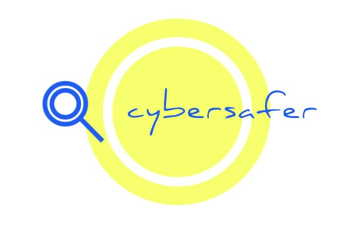
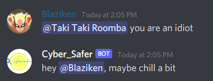
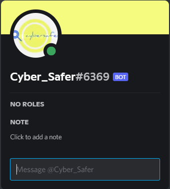
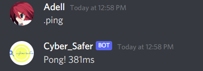

<h2 align= "center"><b>Cyber Safer</b></h2>

<h2 align= "left"><b>Problem Statement</b></h2>
The internet is a great place, Information being shared in a matter of seconds, almost an infinite amount of knowledge and billions of people connected worldwide. The internet allows people of similar interests to come together and share their interests and opinions, while people can hide behind an alias. This anonymity is a double edged sword. People can abuse it to be...... "not so friendly" with others. 

<h2 align= "left"><b>Our Solution</b></h2>
Cyber Safer is our solution to make the internet a more friendly place. Our model detects traces of offensive/abusive language, which can be used to notify the moderators on the respective forums and have them decide on the right judgement.For demonstration purposes, we have chosen to build a discord bot. The internet is too good of an invention to be gate-keeped by bullies, this is our way to make it more accessible to everyone, everywhere.
  
Our project was infuenced by the ideas presented in the following research paper by Andrea Perera and Pumudu Fernando from the Informatics Institute of Technology, Colombo.
https://www.sciencedirect.com/science/article/pii/S1877050921002507
  

  

<h2 align= "left"><b>Tech Stack Used</b></h2>

*Python*
* discord.py
* nltk
* scikit-learn
* pandas

                                                                                                                                
